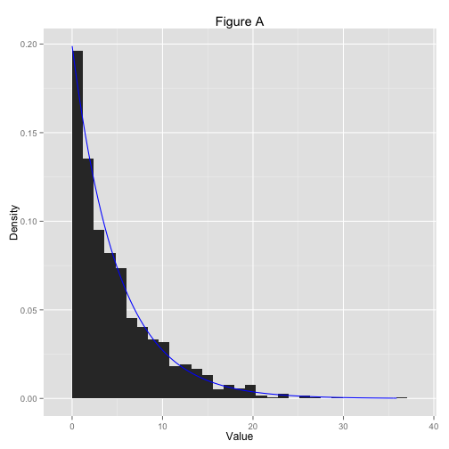
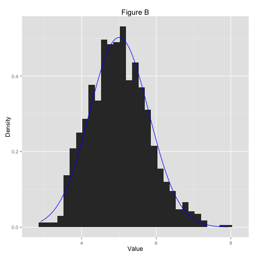

Fitting Simulated Data
========================================================
by Jai Broome

### Requirements

```r
require(ggplot2)
require(MASS)
```
### Introduction
In this exercise, we are comparing simulated data to its theoretical distribution, specifically the exponential distribution. For all simulated data, we will specify that `rate = 0.2`, meaning that the `mean` and `standard deviation` will both converge to `1 / rate == 5`. Looking first at a histogram of 1,000 simulated observations, we can see that it looks generally like we'd expect, with some deviation. Plotting an exponential fit with the rate calculated from the simulated data shows that the fit is very good.

### Simulation

```r
set.seed(808)
first.obs <- data.frame(rexp(1000, 0.2))
colnames(first.obs) <- "V1"
fit1 <- fitdistr(first.obs$V1, "exponential") 
```

I originally plotted an exponential fit with `rate = 0.2`, but the estimated rate was so close to the actual value that it was impossible to see any difference on this scale (Figure A).

Lets now look at the distribution of 1,000 groups of 40 observations. 

```r
second.obs <- rep.int(0, 40000); dim(second.obs) <- c(40, 1000)
for(i in 1:1000) {
    second.obs[, i] <- rexp(40, 0.2)
}

exp.means <- data.frame(apply(second.obs, 2, mean))
colnames(exp.means) <- "V1"
```

The distribution is a little "lumpier", but it's also clustered more tightly about the mean (Figure B). A standard normal fit is plotted on top of the histogram
### Sample mean vs theoretical mean


```r
mean(first.obs$V1)
```

```
## [1] 5.023439
```

```r
mean(exp.means$V1)
```

```
## [1] 5.005719
```
We see that the sample mean of both sets converge to the theoretical mean (`1 / rate == 5`).

### Sample variance vs theoretical variance

```r
sd(first.obs$V1)
```

```
## [1] 4.945423
```

```r
sd(exp.means$V1)
```

```
## [1] 0.7943972
```

```r
5 / 40 ^ 0.5
```

```
## [1] 0.7905694
```

```r
var(first.obs$V1)
```

```
## [1] 24.45721
```

```r
var(exp.means$V1)
```

```
## [1] 0.6310669
```
Here we see a significant difference between the grouped observations. The standard deviation of the first 1,000 observations converge to the expected `1 / rate = 5`, but the standard devations of the means is much smaller; it approaches the calculated SEM (`0.79`).

## Appendix
### Figures

```r
ggplot(first.obs, aes(x = V1)) +
    geom_histogram(aes(y = ..density..)) + 
    stat_function(fun = dexp, 
                color = "blue", 
                 args = list(rate = fit1$estimate)) +
    xlab("Value") +
    ylab("Density") +
    ggtitle("Figure A")
```

```
## stat_bin: binwidth defaulted to range/30. Use 'binwidth = x' to adjust this.
```

 

*1000 simulated data points drawn from* `rexp`


```r
ggplot(exp.means, aes(x = V1)) +
    geom_histogram(aes(y = ..density..)) + 
    stat_function(fun = dnorm, 
                  args = list(mean = mean(exp.means[, 1]), 
                                sd = sd(exp.means[, 1])),
                  color = "blue") +
    xlab("Value") +
    ylab("Density") +
    ggtitle("Figure B")
```

```
## stat_bin: binwidth defaulted to range/30. Use 'binwidth = x' to adjust this.
```

 

*1000 simulated data points taken by averaging 40 observations drawn from* `rexp`
